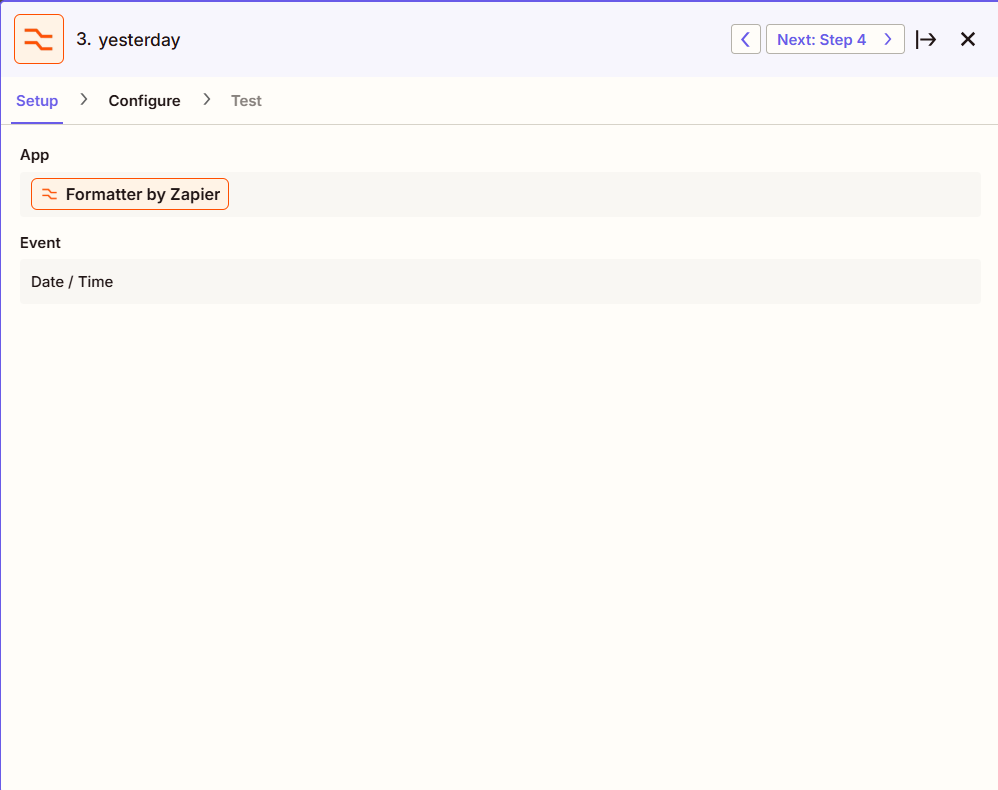

# Fetching HubSpot Data for Automated Daily Report Delivery to Slack

## Overview

In this project, I automated a daily report using CRM data from HubSpot, with Zapier orchestrating the workflow and Slack serving as the communication platform for report delivery. The objective was to create a concise, actionable summary of daily activities — such as new lead creation, communications, Zoom bookings, and deal negotiations — and post it automatically for the team’s visibility. Through this process, I strengthened my skills in automation workflow design, CRM data integration, and effective communication of business metrics, while reinforcing best practices in documentation and collaborative project sharing.

You can view the full python code [here](https://github.com/Nuttaz/Fetch_HubSpot_Data_to_Slack/tree/main/fetch_hubspot_data.py)

## The Objective
The objective is to automate a daily report using CRM Hubspot data and post it to a Slack channel every day at 5 PM GMT+7. The report will summarize key performance activities, including the total number of new leads created, contacts made, Zoom bookings, and deal negotiations. To keep the report concise and focused, it will only include data from users who had activity on the reporting day, minimizing unnecessary information.

## Tools I Used
To automate and streamline the daily reporting process, I leveraged several powerful tools:
- **Zapier**: Served as the primary automation platform, enabling the scheduling, execution, and delivery of the daily report with minimal manual intervention.
- **HubSpot**: Functioned as the central CRM system where all sales and marketing activities were recorded, providing the essential data for report generation.
- **Slack**: Used as the communication platform to distribute the daily report efficiently to all relevant team members.
- **Visual Studio Code**: mployed for project documentation and management, particularly for maintaining and updating the `readme.md` file.
- **GitHub**: Used for sharing and hosting the project repository.

## The Process





### Python Code
``` python
import requests
import datetime
from datetime import timezone, timedelta
import time
import json

# --- Configuration and Setup ---

hubspot_api_key = input_data['hubspot_api_key']

cc_team = json.loads(input_data['cc_team'])
sales_team = json.loads(input_data['sales_team'])
main_lead_source = [source.strip() for source in json.loads(input_data['main_lead_source'])]

# --- Time Range: Yesterday 17:00 to Today 16:59 (GMT+7) ---

tz_gmt7 = timezone(timedelta(hours=7))
now = datetime.datetime.now(tz=tz_gmt7)
yesterday = now - timedelta(days=1)

start_time = yesterday.replace(hour=17, minute=0, second=0, microsecond=0)
end_time = now.replace(hour=16, minute=59, second=59, microsecond=999999)

start_timestamp = int(start_time.timestamp() * 1000)
end_timestamp = int(end_time.timestamp() * 1000)

# --- HubSpot API Utilities ---

def fetch_all_hubspot_contacts(filters, properties=None, limit=100, retries=3):
    url = "https://api.hubapi.com/crm/v3/objects/contacts/search"
    headers = {
        "Content-Type": "application/json",
        "Authorization": f"Bearer {hubspot_api_key}"
    }

    all_results = []
    after = None

    while True:
        payload = {
            "filterGroups": [{"filters": filters}],
            "properties": properties or ["email"],
            "limit": limit
        }
        if after:
            payload["after"] = after

        for attempt in range(retries):
            time.sleep(0.2)
            response = requests.post(url, headers=headers, json=payload)
            if response.status_code == 200:
                break
            elif response.status_code == 429:
                time.sleep((attempt + 1) * 0.5)
            else:
                raise Exception(f"HubSpot API error: {response.status_code} - {response.text}")
        else:
            raise Exception("Exceeded retry limit for HubSpot API.")

        data = response.json()
        all_results.extend(data.get("results", []))
        after = data.get("paging", {}).get("next", {}).get("after")
        if not after:
            break

    return all_results

# --- Filter Helpers ---

def between_filter(property_name):
    return [{
        "propertyName": property_name,
        "operator": "BETWEEN",
        "value": start_timestamp,
        "highValue": end_timestamp
    }]

def eq_filter(property_name, value):
    return [{"propertyName": property_name, "operator": "EQ", "value": value}]

# --- Fetch Leads ---

allocate_filters = between_filter("date_entered__new_lead__new_lifecycle_stage_pipeline__")
create_filters = between_filter("createdate")
properties = ["email", "lead_type", "lead_source"]

leads_allocate = fetch_all_hubspot_contacts(allocate_filters, properties)
leads_create = fetch_all_hubspot_contacts(create_filters, properties)

lead_source_create = {
    "lead_source_create_count": fetch_all_hubspot_contacts(between_filter("createdate"), properties=["lead_source"])}

# --- Clean & Order Unique Lead Sources ---
lead_source_with_activity = list({contact["properties"]["lead_source"]
                                  for contacts in lead_source_create.values()
                                  for contact in contacts
                                  if contact.get("properties", {}).get("lead_source")})

# --- Categorize Leads ---

def filter_by_type(leads, lead_type):
    return [l for l in leads if l.get("properties", {}).get("lead_type") == lead_type]

def match_lead_source(leads, keyword):
    return [l for l in leads if keyword.lower() in (l.get("properties", {}).get("lead_source") or "").lower()]

def match_blank_lead_source(leads):
    return [l for l in leads if not l.get("properties", {}).get("lead_source")]

lead_types = {
    "new_lead": filter_by_type(leads_allocate, "New Lead"),
    "duplicate_lead": filter_by_type(leads_allocate, "Duplicate"),
    "resubmitted_lead": filter_by_type(leads_allocate, "Resubmitted"),
    "nurture_lead": filter_by_type(leads_allocate, "Nurture"),
    "self_gen_lead": filter_by_type(leads_allocate, "Self Gen"),
}

lead_sources = {
    source.lower(): match_lead_source(leads_create, source)
    for source in main_lead_source
}
lead_sources["no_lead_source"] = match_blank_lead_source(leads_create)

# --- Lifecycle Stage Fetches ---

lifecycle_stage = {
    "contact_count": fetch_all_hubspot_contacts(between_filter("date_entered__contact__new_lifecycle_stage_pipeline__"), properties=["secondary_owner","hubspot_owner_id"]),
    "take_over_call_count": fetch_all_hubspot_contacts(between_filter("takeover_date_time") + eq_filter("takeover_type", "TO Call"), properties=["secondary_owner","hubspot_owner_id"]),
    "take_over_text_count": fetch_all_hubspot_contacts(between_filter("takeover_date_time") + eq_filter("takeover_type", "TO Text"), properties=["secondary_owner","hubspot_owner_id"]),
    "zoom_book_count": fetch_all_hubspot_contacts(between_filter("date_entered__zoom_booked__new_lifecycle_stage_pipeline__"), properties=["secondary_owner","hubspot_owner_id"]),
    "zoom_attend_count": fetch_all_hubspot_contacts(between_filter("date_entered__zoom_attended__new_lifecycle_stage_pipeline__"), properties=["secondary_owner","hubspot_owner_id"]),
    "deal_negotiation_count": fetch_all_hubspot_contacts(between_filter("date_entered__deal_negotiation__new_lifecycle_stage_pipeline__"), properties=["secondary_owner","hubspot_owner_id"]),
}

# --- Unique Owner Lists ---

contact_owners_with_activity = {
    contact.get("properties", {}).get("hubspot_owner_id")
    for group in lifecycle_stage.values()
    for contact in group
    if contact.get("properties", {}).get("hubspot_owner_id") and contact.get("properties", {}).get("hubspot_owner_id") not in cc_team
}

unique_contact_owners_with_activity = list(contact_owners_with_activity)

secondary_owners_with_activity = {
    contact.get("properties", {}).get("secondary_owner")
    for group in lifecycle_stage.values()
    for contact in group
    if contact.get("properties", {}).get("secondary_owner")
}

unique_secondary_owners_with_activity = list(secondary_owners_with_activity)

# --- Metrics Fetching ---

def get_count_contact_owner(property_name, sales_id):
    filters = between_filter(property_name) + eq_filter("hubspot_owner_id", sales_id)
    return len(fetch_all_hubspot_contacts(filters))

def get_count_secondary_owner(property_name, sales_id, takeover_type=None):
    filters = between_filter(property_name) + eq_filter("secondary_owner", sales_id)
    if takeover_type:
        filters += eq_filter("takeover_type", takeover_type)
    return len(fetch_all_hubspot_contacts(filters))

def get_count_lead_source(source):
    filters = between_filter("createdate") + eq_filter("lead_source", source)
    return len(fetch_all_hubspot_contacts(filters))

# --- Reports Generation ---

output_sales_direct = []
for sales_id in contact_owners_with_activity:
    sales_name = sales_team.get(sales_id, sales_id)
    report_sales_direct = {
        "Zoom Book": get_count_contact_owner("date_entered__zoom_booked__new_lifecycle_stage_pipeline__", sales_id),
        "Attend": get_count_contact_owner("date_entered__zoom_attended__new_lifecycle_stage_pipeline__", sales_id),
        "Deal Negotiation": get_count_contact_owner("date_entered__deal_negotiation__new_lifecycle_stage_pipeline__", sales_id),
    }
    output_sales_direct.append(
        f"{sales_name}\n"
        f" Zoom Book: {report_sales_direct['Zoom Book']}\n"
        f" Attend: {report_sales_direct['Attend']}\n"
        f" Deal Negotiation: {report_sales_direct['Deal Negotiation']}\n"
    )

output_cc_to = []
for sales_id in unique_secondary_owners_with_activity:
    sales_name = sales_team.get(sales_id, sales_id)
    report_cc_to = {
        "TO Call": get_count_secondary_owner("takeover_date_time", sales_id, "TO Call"),
        "TO Text": get_count_secondary_owner("takeover_date_time", sales_id, "TO Text"),
        "Zoom Book": get_count_secondary_owner("date_entered__zoom_booked__new_lifecycle_stage_pipeline__", sales_id),
        "Attend": get_count_secondary_owner("date_entered__zoom_attended__new_lifecycle_stage_pipeline__", sales_id),
        "Deal Negotiation": get_count_secondary_owner("date_entered__deal_negotiation__new_lifecycle_stage_pipeline__", sales_id),
    }
    output_cc_to.append(
        f"{sales_name}\n"
        f" TO Call: {report_cc_to['TO Call']}\n"
        f" TO Text: {report_cc_to['TO Text']}\n"
        f" Zoom Book: {report_cc_to['Zoom Book']}\n"
        f" Attend: {report_cc_to['Attend']}\n"
        f" Deal Negotiation: {report_cc_to['Deal Negotiation']}\n"
    )

# --- Lead Source Report (Ordered & Complete) ---

output_lead_source = []
grouped_sources = {source: [] for source in main_lead_source}
grouped_sources["Other"] = []

# Group the lead sources
for source in lead_source_with_activity:
    matched = False
    for main_source in main_lead_source:
        if source and main_source and main_source.lower() in source.lower():
            grouped_sources[main_source].append(source)
            matched = True
            break
    if not matched and source:
        grouped_sources["Other"].append(source)

# Build the output while preserving order
for main_source in main_lead_source + ["Other"]:
    sub_sources = sorted(list(set(grouped_sources.get(main_source, []))))
    if not sub_sources:
        continue
    main_count = 0
    sub_lines = []
    for sub_source in sub_sources:
        count = get_count_lead_source(sub_source)
        sub_lines.append(f"{sub_source}: {count}")
        main_count += count

    output_lead_source.append(f"{main_source}: {main_count}")
    output_lead_source.extend(sub_lines)
    output_lead_source.append("")

# --- Final Output ---

output = {
    # --- Lead Type Counts ---
    **{k: len(v) for k, v in lead_types.items()},
    'other_lead': len(leads_allocate) - sum(len(v) for v in lead_types.values()),
    'total_lead_allocate': len(leads_allocate),

    # --- Lead Source Counts ---
    **{k: len(v) for k, v in lead_sources.items()},
    'other_source': len(leads_create) - sum(len(v) for v in lead_sources.values()),
    'total_lead_create': len(leads_create),

    # --- Lifecycle Stage Counts ---
    **{k: len(v) for k, v in lifecycle_stage.items()},

    # --- Reports ---
    'CC TO Report': "\n".join(output_cc_to),
    'Sales Direct Report': "\n".join(output_sales_direct),
    'Lead Source Report': "\n".join(output_lead_source),
}
```


## The Result


The automated daily report was successfully deployed, delivering a comprehensive activity summary to the designated Slack channel each day. Although Zapier requires a brief execution window, the report consistently posts at approximately 5:05 PM GMT+7, ensuring all activities logged throughout the day are captured. The report is organized into clear sections—Allocation Team, Lead Source, CC Team, and Sales Team—highlighting key metrics such as lead allocations, sources, calls, texts, Zoom bookings, and deal negotiations. By focusing only on users with activity for the day, the report remains concise, actionable, and easy for the team to review and respond to.

## What I Learned

Throughout this project, I deepened my understanding of automation, CRM data integration, and workflow optimization by designing and deploying a fully automated daily reporting system. By combining the capabilities of Zapier, HubSpot, and Slack, I gained practical, hands-on experience in automating business processes and ensuring timely information delivery to key stakeholders. My key learnings and developed skills include:

- **Automation Workflow Design**:
I strengthened my ability to design end-to-end automation workflows using Zapier, including multi-step actions, dynamic scheduling, and managing execution delays to align reporting with business requirements (e.g., configuring the report to consistently post at 5:05 PM GMT+7 to account for processing time).
- **CRM Data Handling**:
By working with HubSpot data, I developed practical skills in structuring and filtering CRM records to extract only relevant daily activities, ensuring reports remained focused, actionable, and easy to digest.
- **Effective Communication via Slack Integration**:
I improved my ability to format and present automated messages in Slack in a clear, organized manner, allowing teams to quickly interpret daily performance metrics without unnecessary noise.

## Conclusion

In conclusion, the successful automation of the daily HubSpot report delivered via Slack significantly streamlined team communication and provided timely visibility into key performance indicators. By leveraging Zapier's automation capabilities, integrating seamlessly with HubSpot's CRM data, and delivering concise summaries to Slack, the project achieved its objective of creating an efficient and actionable reporting system. The insights gained into automation workflow design, CRM data handling, and effective communication have not only enhanced my technical skill set but also provided a practical framework for optimizing business processes and fostering data-driven decision-making within the team.